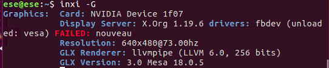
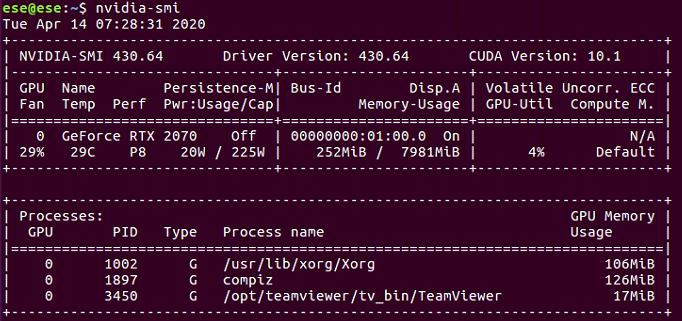

<b>▶ 시작 전 환경 구성</b>

<pre id="code_1586814527199" class="html xml" data-ke-language="html" data-ke-type="codeblock"><code>$ sudo apt-get upgrade

S sudo apt-get update

$ sudo apt-get install build-essential</code></pre>

&nbsp;

&nbsp;

<b><b><b>▶</b>&nbsp;Graphics 확인</b></b>

시스템 정보 출력 툴인 inxi 설치 후 그래픽 확인

<pre id="code_1586815312728" class="html xml" data-ke-language="html" data-ke-type="codeblock"><code>$ sudo apt install inxi

$ inxi -G</code></pre>

&nbsp;

<b><b>▶ </b>nouveau 제거 및 blacklist 등록</b>

아래 경로에 blacklist 파일을 생성한다.

<pre id="code_1586816550451" class="html xml" data-ke-language="html" data-ke-type="codeblock"><code>$ sudo vi /etc/modprobe.d/blacklist-nouveau.conf</code></pre>

생성된 .conf 파일에 아래 두 줄을 입력한다.

<pre id="code_1586816586236" class="html xml" data-ke-language="html" data-ke-type="codeblock"><code>blacklist nouveau
options nouveau modset=0</code></pre>

명령어 입력 후 재부팅한다.

<pre id="code_1586816610599" class="html xml" data-ke-language="html" data-ke-type="codeblock"><code>$ sudo update-initramfs -u 

$ sudo reboot</code></pre>

&nbsp;

<b><b><b>▶&nbsp;</b></b>Nviida driver console 환경 설치</b>

Ubuntu 16.04에서 기본으로 제공하는 X windows 환경을 종료하고 Console 모드로 들어간다.

<pre id="code_1586816768595" class="html xml" data-ke-language="html" data-ke-type="codeblock"><code>$ sudo service lightdm stop</code></pre>

Console 모드에서 ctrl+alt+F1를 누른 후 로그인을 한다. 그 후에 Ubuntu driver를 repository에 등록한다.

<pre id="code_1586816842045" class="html xml" data-ke-language="html" data-ke-type="codeblock"><code>$ sudo add-apt-repository ppa:graphics-drivers/ppa 

$ sudo apt update 

$ sudo ubuntu-drivers autoinstall 

$ sudo reboot</code></pre>

재부팅 후에 아래 명령어를 통해서 Nvidia driver 설치 여부를 확인한다.

<pre id="code_1586816891234" class="html xml" data-ke-language="html" data-ke-type="codeblock"><code>$ nvidia-smi</code></pre>

inix를 통해 그래픽을 확인해본다.

<pre id="code_1586939853963" class="html xml" data-ke-language="html" data-ke-type="codeblock"><code>inxi -G</code></pre>

<b>🔗 Reference</b>

<ul style="list-style-type: disc;" data-ke-list-type="disc">
<li><a href="https://driz2le.tistory.com/254" target="_blank" rel="noopener">ubuntu 18.04 - 우분투(Ubuntu) nvidia driver 설치 및 업그레이드</a></li>
</ul>

&nbsp;

