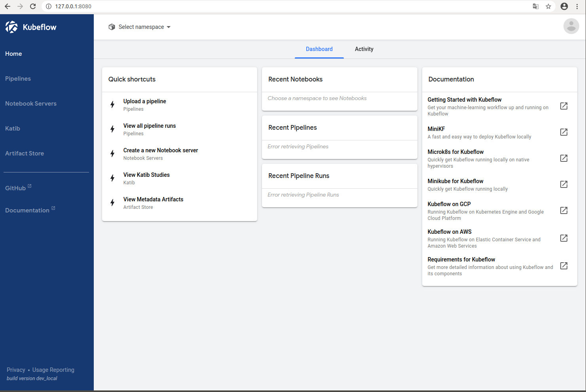

Setting

<details>
<summary> Docker (눌러서 내용보기) </summary>
<div markdown="1">  

##### 🌼 Docker Download
[dockerInit.sh](dockerInit.sh)

##### 🌼 Sudo 명령없이 Docker 실행
[dockerSudo.sh](dockerSudo.sh)

##### 🌼 docker 특정 버전 다운로드
[docker downgrade](https://docs.docker.com/engine/install/ubuntu/)
```
apt-get install docker-ce=5:18.09.1~3-0~ubuntu-xenial docker-ce-cli=5:18.09.1~3-0~ubuntu-xenial containerd.io
```

##### 🌼 docker cgroup 확인
```
docker info | grep -i cgroup
```

</div>
</details>

<details>
<summary> 방화벽 설정 (눌러서 내용보기) </summary>
<div markdown="1">
kubernetes 환경에서 사용하는 포트는 다음 페이지에 있으며, worker와 master에서 사용하는 포트가 다 다르다.  

https://kubernetes.io/docs/setup/production-environment/tools/kubeadm/install-kubeadm/#check-required-ports  

##### 🌼 MasterNode 방화벽
[firewallMaster.sh](./firewallMaster.sh)

##### 🌼 WorkerNode 방화벽
[firewallWorker.sh](./firewallWorker.sh)

##### 🌼 Calico 포트 방화벽 열기
[firewallCalico.sh](./firewallCalico.sh)

##### 🌼 Flannel 포트 방화벽 열기
[firewallFlannel.sh](./firewallFlannel.sh)

##### 🌼 모든 방화벽 열기
```
systemctl stop firewalld
```

</div>
</details>

<details>
<summary> Selinux (눌러서 내용보기) </summary>
<div markdown="1">  

[selinux.sh](./selinux.sh)

</div>
</details>

<details>
<summary> Kubelet, Kubeadm Kubectl 설치 (눌러서 내용보기) </summary>
<div markdown="1">  

```
sudo apt install apt-transport-https
curl -s https://packages.cloud.google.com/apt/doc/apt-key.gpg | sudo apt-key add
sudo add-apt-repository "deb https://apt.kubernetes.io/ kubernetes-$(lsb_release -cs) main"
sudo apt update
sudo apt install kubelet=1.14.1-00 kubeadm=1.14.1-00 kubectl=1.14.1-00 kubernetes-cni=0.7.5-00

# 패키지가 자동으로 설치, 업그레이드, 제거되지않도록 고정함
sudo apt-mark hold kubelet kubeadm kubectl

kubeadm version
kubelet --version
kubectl version
```

[k8s_install.sh](./k8s_install.sh)  
yum에서 repository문제 시 apt-get으로  
[ubuntu16.04_kubernetes_install.md](./ubuntu16.04_kubernetes_install.md) 참고해서 설치  

1.14.x 버전으로 만들어야하면 아래 소스를 참고해요!  
[k8s_downgrade.sh](./k8s_downgrade.sh)

##### 🌼 kubelet 재실행하기
```
systemctl restart kubelet
```

##### 🌼 kubelet 상태보기
```
systemctl status kubelet
```

##### 🌼 kubelet 로그보기
```
journalctl -xeu kubelet
```

##### 🌼 kubelet 다시 다운로드
```
apt-get purge kubelet && apt-get install kubelet=1.14.0-00
```
</div>
</details>

<details>
<summary> net.bridge.bridge-nf-call-iptables 설정 (눌러서 내용보기) </summary>
<div markdown="1">  

[net_bridge.sh](./net_bridge.sh)

</div>
</details>

<details>
<summary> swap Off (눌러서 내용보기) </summary>
<div markdown="1">  

Kubernetes는 Master, Worker 노드 모두 swap을 off 해야한다.   
Swap이 off 되어 있지 않으면 kubeadm init 단계에서   
`"[ERROR SWAP]: running with swap on is not supported. Please disable swap"` 에러가 출력된다.  
[swapOff.sh](./swapOff.sh)

```
sudo swapoff -a
sudo sed -i '/swap/s/^/#/' /etc/fstab
```
</div>
</details>

<details>
<summary> kubeadm init (눌러서 내용보기) </summary>
<div markdown="1">  

[Create Cluster Kubeadm](https://kubernetes.io/docs/setup/production-environment/tools/kubeadm/create-cluster-kubeadm/)

pod network add-on의 종류에 따라서 `--pod-network-cidr` 설정 값을 다르게 해주어야 한다.   

pod network add-on로 Calico를 사용하므로 `--pod-network-cidr` 설정 값을 `192.168.0.0/16`으로 해야 하지만 가상머신 네트워크 대역인 `192.168.0.5/24`와 겹치기 때문에 `172.16.0.0/16`으로 변경하여 사용하자.

[k8s_init.sh](./k8s_init.sh)

</div>
</details>

<details>
<summary> Calico 설치 (눌러서 내용보기) </summary>
<div markdown="1">  

[Calico 설치](https://docs.projectcalico.org/v3.3/getting-started/kubernetes/installation/calico)  

`kubectl get pods -n kube-system`
 - pod network add-on이 설치되어 있지 않은 상태에서는 CoreDNS가 아직 시작되지 않은 상태를 확인할 수 있다.


 - pod network add-on 설치는 Master 노드에서만 한다.   
`kubeadm init` 단계에서 `--pod-network-cidr` 설정 값을 `172.16.0.0/16`으로 변경하여 사용하기는 했지만 Calico YAML 파일에서도 값을 변경하여 설치해야 한다.

[calico.sh](./calico.sh)

- pod network add-on를 설치한 이후에 CoreDNS가 정상적으로 시작된 상태를 확인할 수 있다.


```
kubectl describe pod coredns-fb8bdccf-ppzwm -n kube-system
```

```
kubectl logs -n kube-system coredns-fb8bdccf-ppzwm -n kube-system
```

</div>
</details>

<details>
<summary> kubeadm join (눌러서 내용보기) </summary>
<div markdown="1">   

 Worker 노드가 되기 위해서는 `kubeadm join` 명령어를 실행해서 Master 노드에 등록해야 한다.   
 `kubeadm join` 명령어 실행에 필요한 옵션들은 Master 노드에서 아래 명령어를 실행해서 확인할 수 있다.

```
 kubeadm token create --print-join-command
```

- worker node 등록
```
kubeadm join 192.168.0.5:6443 --token hcfumm.jerovbeueijtcflc --discovery-token-ca-cert-hash sha256:5e895759bvavsdsifsadad0...
```

</div>
</details>

--- 

```
kubectl get nodes
```


kubeflow install은 다음 블로그에 잘 정리해 놓았다. 우리는 kubernetes를 잘 다운받았으니 minikube 다음부터 진행하면 된다.
http://ghcksdk.com/kubeflow-installation/



- Error
    - [coredns error](https://github.com/kubernetes/kubeadm/issues/1292)  


- 참고자료
    - [Kubernetes 설치 및 환경 구성하기](https://medium.com/finda-tech/overview-8d169b2a54ff)
    - [coredns CrashLoopBackOff due to dnsmasq#1292](https://github.com/kubernetes/kubeadm/issues/1292)
    - [Docker, Kubernetes 환경에서 CUBRID 컨테이너 서비스 해보기](https://www.cubrid.com/blog/3820603)
