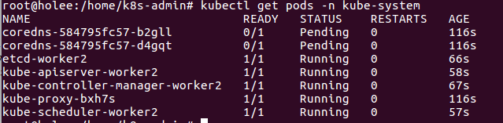
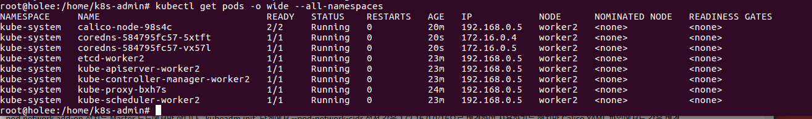
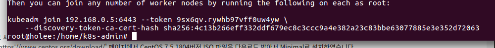
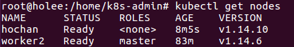
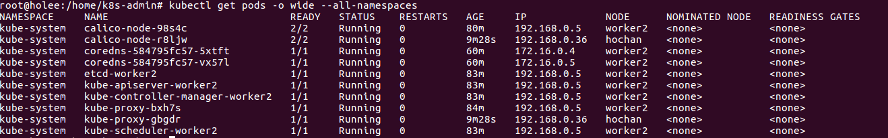

Setting

<details>
<summary> Docker (눌러서 내용보기) </summary>
<div markdown="1">  

##### 🌼 Docker Download
[dockerInit.sh](dockerInit.sh)

##### 🌼 Sudo 명령없이 Docker 실행
[dockerSudo.sh](dockerSudo.sh)

</div>
</details>

<details>
<summary> 방화벽 설정 (눌러서 내용보기) </summary>
<div markdown="1">
kubernetes 환경에서 사용하는 포트는 다음 페이지에 있으며, worker와 master에서 사용하는 포트가 다 다르다.  

https://kubernetes.io/docs/setup/production-environment/tools/kubeadm/install-kubeadm/#check-required-ports  

##### 🌼 MasterNode 방화벽
[firewallMaster.sh](./firewallMaster.sh)

##### 🌼 WorkerNode 방화벽
[firewallWorker.sh](./firewallWorker.sh)

##### 🌼 Calico 포트 방화벽 열기
[firewallCalico.sh](./firewallCalico.sh)

</div>
</details>

<details>
<summary> Selinux (눌러서 내용보기) </summary>
<div markdown="1">  

[selinux.sh](./selinux.sh)

</div>
</details>

<details>
<summary> Kubelet, Kubeadm Kubectl 설치 (눌러서 내용보기) </summary>
<div markdown="1">  

[k8s_install.sh](./k8s_install.sh)
yum에서 repository문제 시 apt-get으로
[ubuntu16.04_kubernetes_install.md](./ubuntu16.04_kubernetes_install.md) 참고해서 설치
1.14.x 버전으로 만들어야하면 아래 소스를 참고해요!
[k8s_downgrade.sh](./k8s_downgrade.sh)

</div>
</details>

<details>
<summary> net.bridge.bridge-nf-call-iptables 설정 (눌러서 내용보기) </summary>
<div markdown="1">  

[net_bridge.sh](./net_bridge.sh)

</div>
</details>

<details>
<summary> swap Off (눌러서 내용보기) </summary>
<div markdown="1">  

Kubernetes는 Master, Worker 노드 모두 swap을 off 해야한다. Swap이 off 되어 있지 않으면 kubeadm init 단계에서 "[ERROR SWAP]: running with swap on is not supported. Please disable swap" 에러가 출력된다.  
[swapOff.sh](./swapOff.sh)

</div>
</details>

<details>
<summary> kubeadm init (눌러서 내용보기) </summary>
<div markdown="1">  
https://kubernetes.io/docs/setup/production-environment/tools/kubeadm/create-cluster-kubeadm/

pod network add-on의 종류에 따라서 --pod-network-cidr 설정 값을 다르게 해주어야 한다. pod network add-on로 Calico를 사용하므로 --pod-network-cidr 설정 값을 192.168.0.0/16으로 해야 하지만 가상머신 네트워크 대역인 192.168.0.5/24와 겹치기 때문에 172.16.0.0/16으로 변경하여 사용하자.

[k8s_init.sh](./k8s_init.sh)
</div>
</details>

<details>
<summary> Calico 설치 (눌러서 내용보기) </summary>
<div markdown="1">  
https://docs.projectcalico.org/v3.3/getting-started/kubernetes/installation/calico

kubectl get pods -n kube-system
 - pod network add-on이 설치되어 있지 않은 상태에서는 CoreDNS가 아직 시작되지 않은 상태를 확인할 수 있다.


pod network add-on 설치는 Master 노드에서만 한다. 'kubeadm init' 단계에서 --pod-network-cidr 설정 값을 172.16.0.0/16으로 변경하여 사용하기는 했지만 Calico YAML 파일에서도 값을 변경하여 설치해야 한다.

[calico.sh](./calico.sh)

pod network add-on를 설치한 이후에 CoreDNS가 정상적으로 시작된 상태를 확인할 수 있습니다.

</div>
</details>

<details>
<summary> kubeadm join (눌러서 내용보기) </summary>
<div markdown="1">  
 Worker 노드가 되기 위해서는 'kubeadm join' 명령어를 실행해서 Master 노드에 등록해야 한다. 'kubeadm join' 명령어 실행에 필요한 옵션들은 Master 노드에서 아래 명령어를 실행해서 확인할 수 있다.

```
 kubeadm token create --print-join-command
```

- worker node 등록
```
kubeadm join 192.168.0.5:6443 --token hcfumm.jerovbeueijtcflc --discovery-token-ca-cert-hash sha256:5e895759bvavsdsifsadad0...
```

</div>
</details>

```
kubectl get nodes
```




- Error

<coredns error>
https://github.com/kubernetes/kubeadm/issues/1292

- 참고자료

cubrid.com/blog/3820603